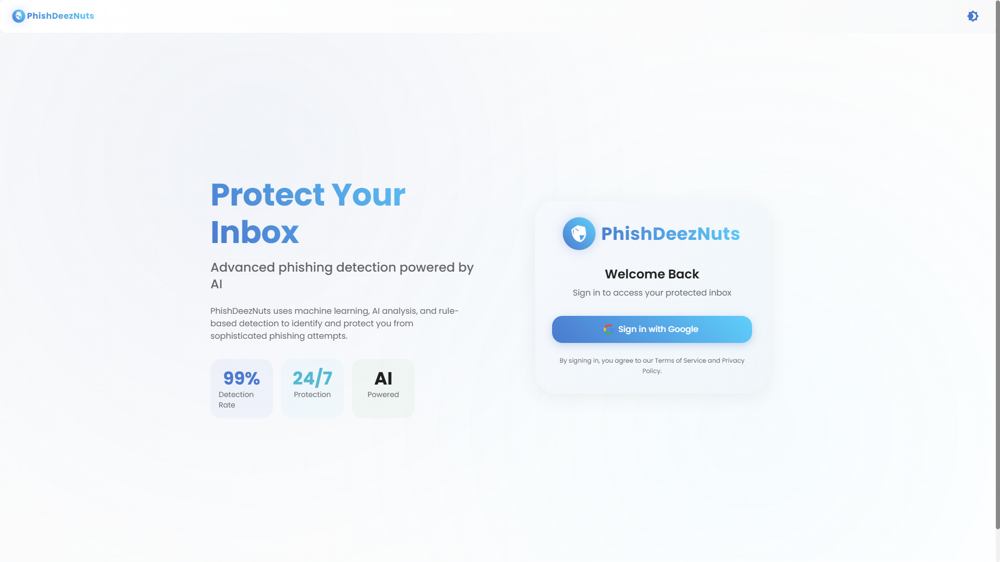
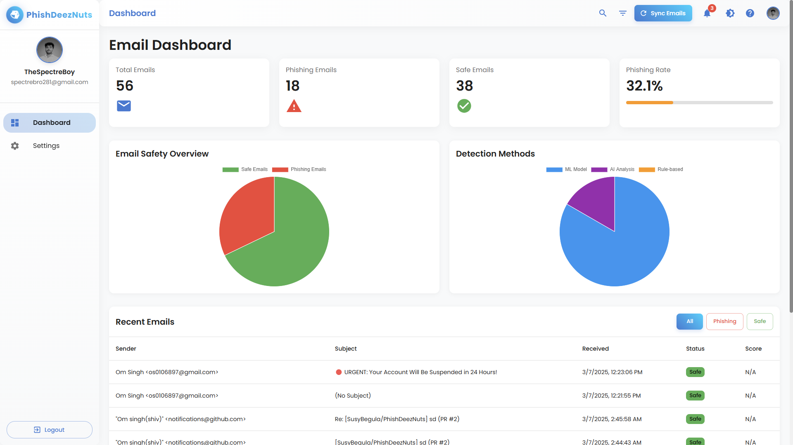
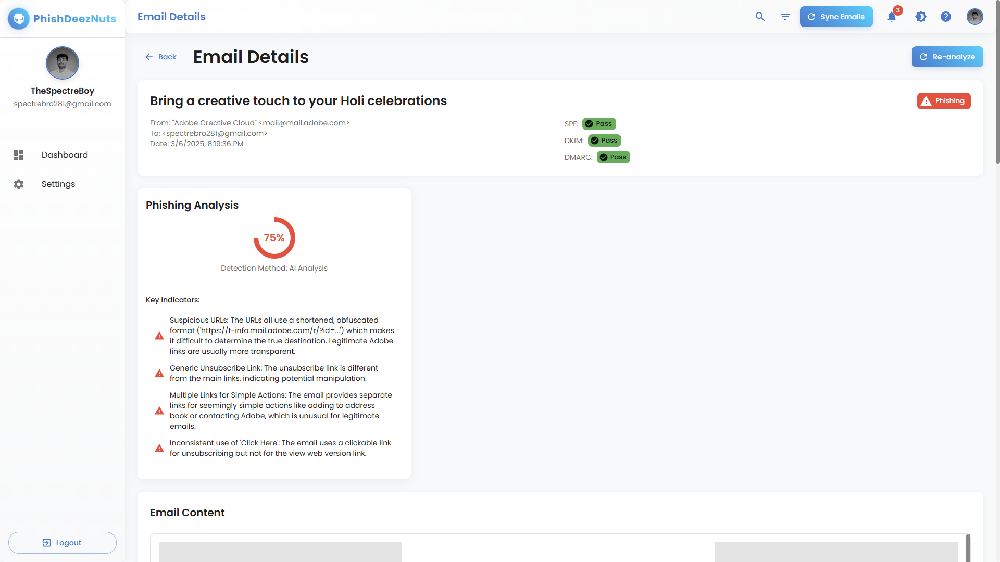
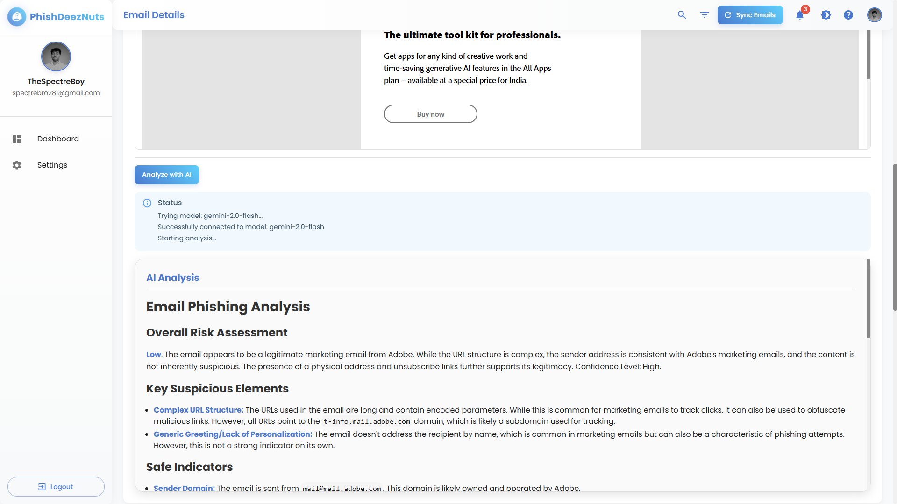
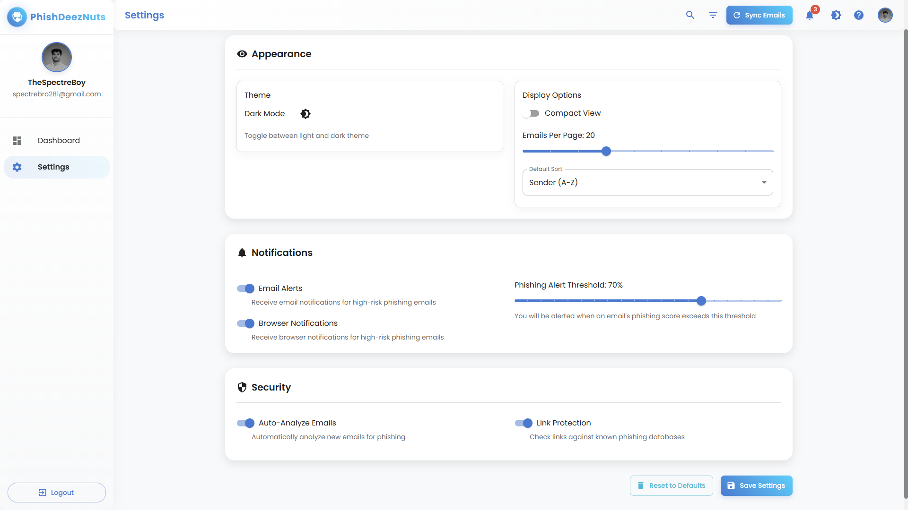

# PhishDeezNuts - AI-Powered Phishing Email Detection

PhishDeezNuts is a sophisticated email security application that uses machine learning, rule-based analysis, and Google's Gemini AI to detect phishing attempts in your Gmail inbox.
## Video of working
https://youtu.be/C7EZDW05sXw
## Working Demo
<p align="center">
  
</p>

<p>
  
</p>

<p align="center">
  
</p>

<p>
  
</p>

<p align="center">
  
</p>


## Features

- 🤖 **Multi-layered Detection System**
  - Machine Learning (Random Forest) analysis
  - Rule-based pattern detection
  - Google Gemini AI analysis for complex cases

- 📧 **Gmail Integration**
  - Secure OAuth2 authentication
  - Real-time email scanning
  - Automatic inbox monitoring

- 🎯 **Advanced Analysis**
  - URL and domain analysis
  - Sender credibility checking
  - Email authentication verification (SPF, DKIM, DMARC)
  - Attachment scanning

- 📊 **Detailed Reporting**
  - Phishing probability scores
  - Detailed threat analysis
  - False positive management
  - Historical tracking

## Prerequisites

- Python 3.8 or higher
- Node.js 14.x or higher
- Gmail account
- Google Cloud Platform account
- Gemini API key

## Setup Instructions

### 1. Clone the Repository

```bash
git clone https://github.com/susybegula/PhishDeezNuts.git
cd PhishDeezNuts
```

### 2. Backend Setup

1. Create and activate a virtual environment:
```bash
cd backend
python -m venv venv
source venv/bin/activate  # On Windows: venv\Scripts\activate
```

2. Install dependencies:
```bash
pip install -r requirements.txt
```

3. Set up environment variables:
```bash
cp .env.example .env
```

Edit `.env` with your configuration:
```
# Flask configuration
SECRET_KEY=your-secret-key-here
FLASK_APP=app.py
FLASK_ENV=development

# Database configuration
DATABASE_URI=sqlite:///phishdeez.db

# Google OAuth configuration
GOOGLE_CLIENT_ID=your-google-client-id
GOOGLE_CLIENT_SECRET=your-google-client-secret
FRONTEND_URL=http://localhost:3000

# Gemini API configuration
GEMINI_API_KEY=your-gemini-api-key
```

4. Initialize the database:
```bash
flask db upgrade
```

5. Start the backend server:
```bash
python app.py
```

### 3. Frontend Setup

1. Install dependencies:
```bash
cd frontend
npm install
```

2. Set up environment variables:
```bash
cp .env.example .env
```

Edit `.env` with your configuration:
```
REACT_APP_API_URL=http://localhost:5000
```

3. Start the frontend development server:
```bash
npm start
```

### 4. Google Cloud Platform Setup

1. Go to the [Google Cloud Console](https://console.cloud.google.com)
2. Create a new project
3. Enable the following APIs:
   - Gmail API
   - People API
4. Configure OAuth consent screen:
   - Add your email as a test user
   - Add required scopes:
     - `https://mail.google.com/`
     - `https://www.googleapis.com/auth/userinfo.profile`
     - `https://www.googleapis.com/auth/userinfo.email`
5. Create OAuth 2.0 credentials:
   - Application type: Web application
   - Authorized redirect URIs:
     - `http://localhost:5000/auth/authorize`
   - Copy the Client ID and Client Secret to your backend `.env` file

### 5. Gemini API Setup

1. Get your Gemini API key from [Google AI Studio](https://makersuite.google.com/app/apikey)
2. Add the API key to your backend `.env` file as `GEMINI_API_KEY=your-api-key-here`
3. Make sure your API key has access to the Gemini models (gemini-pro or gemini-1.5-flash)
4. If you encounter model access issues, you may need to:
   - Create a new API key with the appropriate permissions
   - Check your quota limits in the Google AI Studio dashboard
   - Verify that your Google Cloud project has the Gemini API enabled

## Usage

1. Access the application at `http://localhost:3000`
2. Sign in with your Google account
3. Allow the requested permissions
4. The application will start analyzing your emails

## Development

### Training the ML Model

To train or retrain the machine learning model:

```bash
cd backend
source venv/bin/activate
python -m app.services.ml_model train
```

### Running Tests

```bash
# Backend tests
cd backend
pytest

# Frontend tests
cd frontend
npm test
```

## Security Considerations

- The application requires access to your Gmail inbox
- All email data is processed locally
- No email content is stored permanently
- OAuth2 is used for secure authentication
- Session cookies are secure and HTTP-only
- Regular security audits are recommended


## License

This project is licensed under the MIT License - see the [LICENSE](LICENSE) file for details.


## Star Nuts
[](https://star-history.com/#SusyBegula/PhishDeezNuts&Date)
